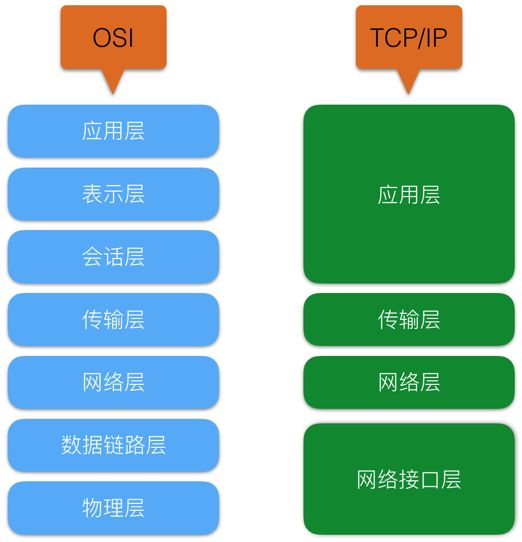

# 计算机网络

计算机网络最基本的功能就是将分别独立的计算机系统互联起来，网络用户可以共享网络资源及相互间通信，常见的网络模型有：

- OSI七层模型：**开放系统互连参考模型**(Open System Interconnection)
- TCP/IP四层模型：**传输控制协议**(Transmission Control Protocol/Internet Protocol) 

通常使用最多的还是TCP/IP模型

## OSI七层模型

国际标准化组织（ISO）于1979年提出的OSI参考模型，其目的旨在于规范当时的TCP/IP四层模型，但由于当时的TCP/IP模型已经流行并且深入人心，且OSI相对TCP/IP过于重量级，且为了接口规范，对性能上做了妥协，效率相对不高，仅供学习参考，实际使用的为TCP/IP模型

OSI从最底部的物理层到最顶层的应用层，共7层，下三层主要负责通信功能，一般称为子网通信层，常以硬件和软件相结合的方式实现，上面三层属于子网资源的功能范畴，称为子网资源，通常以软件的方式来实现。传输层起着衔接上下三层的作用。

## TCP/IP四层模型
TCP/IP（Transmission Control Protocol/Internet Protocol，传输控制协议/因特网协议）四层网络模型，也有人愿意归为 “五层网络模型”，以其中最重要的 TCP 协议和 IP 协议命名。

- 物理层

  Physical layer 提供为为建立、维护和拆除物理链路所需的机械、电气、功能和规范的特征，负责在传输介质上传输非结构的位流，实现**相邻计算机节点之间的比特数据流的透明传送**，尽可能屏蔽具体传输介质或物理设备的差异，并提供物理链路故障检测指示。

- 数据链路层

  Data Link layer通过一些数据链路层协议和链路控制规程，在不太可靠的物理链路上实现可靠的数据传输，**为网络层提供点到点无差错帧传输服务，并能进行流量控制**

- 网络层

- 传输层

- 会话层

- 表示层

- 应用层

## 物理层

